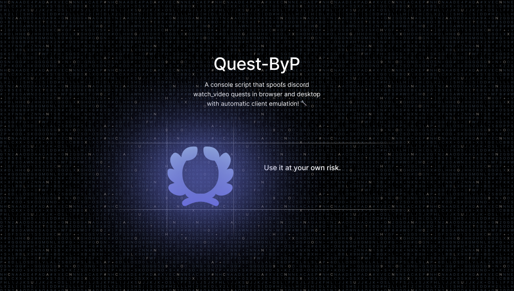

# Discord Quest ByP

> [!WARNING]
> Violates Discord ToS. Risk of ban. Use at your own risk.

A script that automatically completes Discord watch video quests by spoofing progress to the API.

## What It Does

- Injects realistic desktop client properties
- Finds active video watch quests
- Sends fake progress timestamps to Discord API
- Randomizes timing and client versions to avoid detection

## Usage

### Browser

1. Go to [discord.com/quest-home](https://discord.com/quest-home)
2. Open console: `Ctrl + Shift + I` → Console
3. Paste script and run

### Desktop Client

1. Open Discord app
2. Press `Ctrl + Shift + I` → Console
3. Paste script and run

The script runs automatically and logs progress to console.

> [!TIP]
> If stuck at high %, run again after 10 minutes.

## How It Works

The script mimics legitimate behavior by rotating client identifiers and varying request timing. It submits fake video completion data that Discord's validation accepts.

## Important

> [!IMPORTANT]
> This script spoofs Discord's video validation to complete quests automatically.
> 
> Nobody makes you use it. Risks exist because it violates Discord's Terms. You're responsible for your own account.

## Features

- Works on browser & desktop
- Randomized delays between requests
- Variable client versions
- Most quests done in minutes
- Completes autonomously

## If It Breaks

| Problem | Fix |
|---------|-----|
| Stuck at 50-99% | Wait 10 min, run again |
| No quests found | Check `/quest-home` for active ones |
| Errors in console | Make sure you're logged in |

## Disclaimer

Educational purposes only. You own the consequences—bans, suspensions, whatever. This script will likely work, but Discord can patch it anytime. Don't be surprised if it stops working.

Use it. Don't use it. Just know what you're doing.
